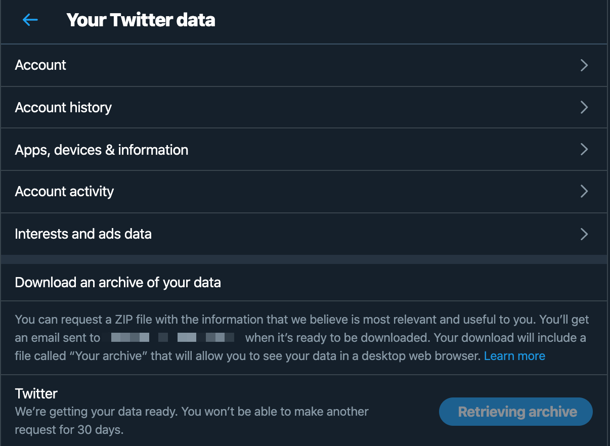

# tweet-del
## Delete your tweets using a simple script written in Golang.

### Step 1: Create a personal backup of all your tweets
In order to delete all your tweets, you need to get a backup of your data first. Twitter allows you to easily export all of your past tweets into a .js file which you need for the next steps.

Navigate to the “Your Twitter Data” section on [Twitter's settings page](https://twitter.com/settings/your_twitter_data). You'll receive a .zip file by mail from Twitter.

### Step 2: Unzip the file
Copy the `tweets.js` (from the data directory) into the folder of this script.

### Step 3: Renaming & Formatting
Rename the file from tweet.**js** to tweet.**json**. Open it using your favorite editor and remove the string `window.YTD.tweet.part0 = `. Save the file.

### Step 4: Create Twitter API keys
Go to the [Twitter Developer](https://developer.twitter.com/en) page and [Create an app](https://developer.twitter.com/en/apps/create).
If you're not familiar with the concept of creating a developer account on Twitter or how to create an app, please follow the [Twitter Docs](https://developer.twitter.com/en/docs).

### Step 5: Copy the keys
Copy the **Consumer Key**, **Consumer Secret**, **Access Token** and **Access Token Secret Key**. Paste it into `ConsumerKey`, `ConsumerSecret`, `AccessToken` and `AccessTokenSecret` in the `main.go` file.

### Step 6: Define the date range
In the `main.go` file, set the values for `DateFrom` and `DateFrom`

### Step 7: Build and run the script
Open your terminal, navigate to the folder of this script and build the script:
`go build main.go`

Afterwards, run the script (like this on MacOS):
`./tweet-del`

## License
The project is licensed under the [MIT license](LICENSE.md).

## 3rd party
The project uses the following libraries:
- [araddon/dateparse]("github.com/araddon/dateparse")
- [dghubble/go-twitter]"(github.com/dghubble/go-twitter/twitter")
- [dghubble/oauth1]("github.com/dghubble/oauth1")